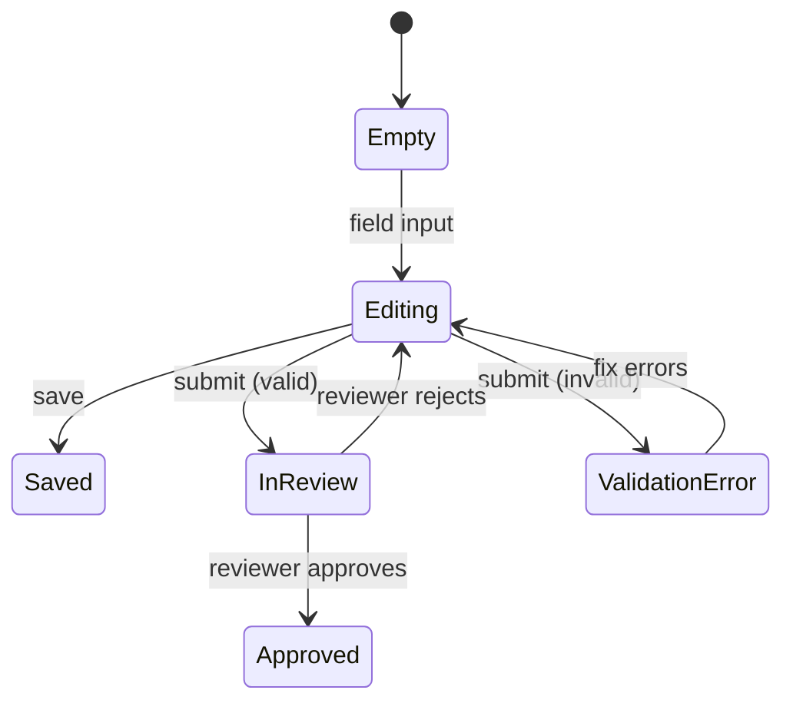

# Markdown Visuals & Wireframing Guide

Reference for representing flows, diagrams, and UI in `.md` files — shown as live rendered examples with copyable templates.

---

## Rendering Compatibility

| Format | VS Code | GitHub | ADO Wiki | ADO Repo |
|---|:---:|:---:|:---:|:---:|
| Tables | ✓ | ✓ | ✓ | ✓ |
| Nested lists | ✓ | ✓ | ✓ | ✓ |
| ASCII in code blocks | ✓ | ✓ | ✓ | ✓ |
| `` images / SVG | ✓ | ✓ | ✓ | ✓ |
| Mermaid | ✗ ext | ✓ | ✓ limited | ✗ |

---

## Flows & Logic

### User Flow

| Step | Actor | Action / Trigger | Condition | Next |
|---|---|---|---|---|
| 1 | User | Opens Offer List | — | 2 |
| 2 | User | Clicks Create New | — | 3 |
| 3 | User | Selects offer type | Device → 4a / Plan → 4b | — |
| 4a | User | Completes Device Editor | — | 5 |
| 4b | User | Completes Plan Editor | — | 5 |
| 5 | User | Saves Draft | — | End |

### State Matrix

| State | Entry condition | UI changes | Available actions |
|---|---|---|---|
| Empty | New offer created | All fields blank | Save Draft, Cancel |
| Editing | Any field changed | Unsaved indicator shown | Save Draft, Submit (if valid) |
| Saved | Draft saved | Toast: "Draft saved" | Edit, Submit, Delete |
| Validation Error | Submit attempted, invalid fields | Error borders + summary | Fix fields, Save Draft |
| In Review | Submitted | Fields read-only. Badge: In Review | View only |
| Approved | Reviewer approves | Badge: Approved | Publish, Revert to Draft |

---

## ASCII Wireframing

Use inside fenced code blocks — renders in monospace across VS Code, GitHub, and ADO without plugins.

Annotate with `{keys}` in the wireframe, then describe each key in a block directly below.

### Character Reference

```
CONTAINERS         FORM ELEMENTS       NOTES
──────────         ─────────────       ─────
┌ ┐ └ ┘ Corners   [Button]  Action    {A}  Annotation key
─ │     Edges      [______]  Input     ···  Truncation
├ ┤ ┬ ┴ Dividers  (○) (●)   Radio     ← →  Direction
┼       Cross      [ ] [x]   Checkbox
                   ▼         Dropdown
```

### Full Page Layout

```
┌──────────────────────────────────────────────────────────┐
│  Dashboard / Offers / New                    {A}         │
│  Create Device Offer              [Cancel] [Create >]    │
├─────────────────────────────┬────────────────────────────┤
│  Basic Information          │  Stakeholders         {D}  │
│  Device Name                │  👤 PO  👤 Legal  👤 Fin   │
│  [_________________________]│  ─────────────────────────  │
│                         {B} │  Timeline                  │
│  Description                │  [Apr 1] ──────── [Apr 30] │
│  [_________________________]│  ─────────────────────────  │
│  [_________________________]│  [      Save Draft      ]  │
│                             │  [ Submit (disabled)    ]  │
│  Offer Type     [Device  ▼] │                       {E}  │
│  Status         [ Draft  ]  │                            │
│                         {C} │                            │
└─────────────────────────────┴────────────────────────────┘
```

**Annotations:**
- **{A} Page header** — Breadcrumb + page title. Persistent. Back arrow returns to offer list.
- **{B} Basic Information** — Card. Device Name is required, 100 char max, validates on blur.
- **{C} Offer Settings** — Offer Type locked after initial save. Status badge is system-managed, not user-editable.
- **{D} Stakeholders** — AvatarGroup. Read-only. Populated from offer configuration.
- **{E} Actions** — Save Draft always enabled. Submit disabled until all required fields are valid.

### Components & States

```
INPUTS
──────
Default:   [______________________________]
Error:     [______________________________]  ✗ Name already exists
Disabled:  [ Device  (locked)             ]

SELECT (open):
           ┌──────────────────┐
           │ Offer Type     ▼ │
           ├──────────────────┤
           │ ● Device         │
           │   Plan           │
           │   Bundle         │
           └──────────────────┘

BUTTONS
───────
[ Cancel ]    [ Create Offer ]    [ Delete ▼ ]
(outline)      (default)           (destructive)
[ ◌ Saving... ]  (loading/disabled)

BADGES
──────
[ Draft ]   [ ● Live ]   [ ✗ Rejected ]   [ ✓ Approved ]
```

### Data Table

```
┌──────────────────────────────────────────────────────┐
│  [ Search...         ]             [Filter] [+ New]  │
├──────┬────────────────────┬────────┬──────────────────┤
│  ☐   │ Offer Name         │ Type   │ Status           │
├──────┼────────────────────┼────────┼──────────────────┤
│  ☐   │ S24 Ultra Early    │ Device │ [ ● Live ]       │
│  ☑   │ Galaxy Watch 7     │ Device │ [ Draft ]        │
│  ☐   │ Starter Plan       │ Plan   │ [ ✓ Approved ]   │
└──────┴────────────────────┴────────┴──────────────────┘
```

### Modal / Dialog

```
         ┌──────────────────────────────┐
         │  Confirm Submission       ✕  │
         ├──────────────────────────────┤
         │  This will send the offer    │
         │  to PO for review.           │
         ├──────────────────────────────┤
         │  [ Cancel ]   [ Submit → ]   │
         └──────────────────────────────┘
```

---

## Structured Wireframing — shadcn/ui

For developer handoff. Use exact component names from `component-library-reference.md`.

**Page Header**
- Breadcrumb: Dashboard / Offers / New
- Heading (H1): Create Device Offer
- Button `outline`: Cancel · Button `default`: Create Offer

**Left column (2/3)**
- Card: Basic Information — Input: Device Name `(required, max 100)` · Textarea: Description
- Card: Offer Settings — Select `(disabled after save)`: Device / Plan / Bundle · Badge `secondary`: Draft

**Right column (1/3)**
- Card: Stakeholders — AvatarGroup: PO, Legal, Finance
- Card: Timeline — DateRangePicker: 2024-04-01 to 2024-04-30
- Card: Actions — Button `default` full-width: Save Draft · Button `outline` full-width `(disabled)`: Submit for Approval

| Component | Variant | State | Condition |
|---|---|---|---|
| Button: Submit | `default` | enabled | All required fields valid |
| Button: Submit | `outline` | disabled | Fields incomplete |
| Badge: Status | `destructive` | — | Rejected |
| Badge: Status | `secondary` | — | Draft |
| Select: Offer Type | — | disabled | After initial save |
| Input: Device Name | — | error | Duplicate name |

---

## Acceptance Criteria

Use `Given / When / Then` for behaviour. Checkbox syntax tracks completion in GitHub and ADO.

- [ ] Given all required fields are valid, when the user clicks Submit, the status changes to In Review and the editor becomes read-only.
- [ ] Given invalid fields exist, when the user clicks Submit, error states appear inline per field with a summary at the top.
- [ ] Given no fields have changed since last save, Save Draft is disabled.

---

## Mermaid (GitHub & ADO Wiki only)

> Doesn't render in VS Code without the [Markdown Preview Mermaid Support](https://marketplace.visualstudio.com/items?itemName=bierner.markdown-mermaid) extension. In ADO wikis use `:::mermaid ... :::` instead of backticks. Use for complex state machines or multi-actor sequences — default to tables for everything else.



---

## Embedded Images

```markdown

```

Use relative paths. Commit the file alongside the `.md`. SVG preferred over PNG.
